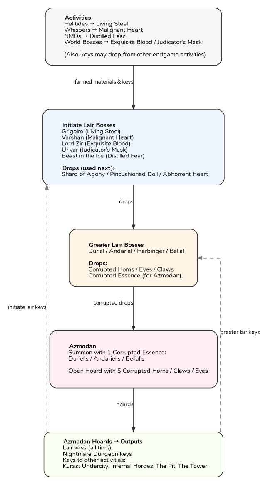

# Diablo 4 Lair Boss Guide

I wrote this guide to remember what keys are needed to unlock boss chests and what keys they drop. Then I fed it to ChatGPT to create a [flowchart](#lair-key--boss-flow). The goal is basically to farm lower level lair bosses to get keys for higher level lair bosses until you can farm Azmodan for endgame loot.

# Major bosses

## Azmodan
- Location: SE of Zarbinzet

Summon through one of:
 - Duriel's Altar - Duriel's Corrupted Essence
 - Andariel's Altar - Andariel's Corrupted Essence
 - Belial's Altar - Belial's Corrupted Essence

Open, one of:
- Duriel's Hoard - 5 Corrupted Horns of Duriel
- Belial's Hoard - 5 Corrupted Eyes of Belial
- Andariel's Hoard - 5 Corrupted Claws of Andariel

### Notes
 - Endgame lair boss keys unlocks att level 73
 - Corrupted Horns / Eyes / Claws cap at around 23 in the inventory. After that they stop dropping.
 - The seasonal divine gift *Essence of Sin* can be leveled up to rank 5. Defeating Azmodan south of Zarbinzet gives 5, as world boss 20. Random red glowing overworld enemies gives 1. Rank 5 requires a total of 1500. At rank 5 you get increased drop rates. Nahantu and Denshar (PvP zone) have the highest density of red glowing enemies. Lowering difficulty to Normal still gives 5 per Azmodan kill. But don't open Hoard chests on Normal, do that on Torment IV for best loot.

# Greater Lair Bosses

All lair keys below can also drop from World Bosses, Events and the Undercity of Kurast with Tribute of Titans. Some can also be found by Bartering in the Den and in NMDs. And they also drop from the Azmodan Hoard chests.

## Belial (exalted)
 - Location: Palace of the Deceiver, Kehjistan, E of Imperial Library
 - Lair Key: **2 Betrayer's Husk** (drops from Mini Belial)
 - Drops: *5 Corrupted Eyes of Belial* + loot from another selectable boss, default Andariel.
 - Note: A Mini version of Belial can randomly appear after opening any lair boss chests. He then drops random lair keys and Corrupted Eyes of Belial. Belial has the highest drop rate of mythical unique items and crafting materials (resplendent sparks, runes).

## Duriel
 - Location: Gaping Crevasse, Kehjistan, East of Gea Kul
 - Lair Key: **3 Shard of Agony** (Hall of the Penitent, Malignant Burrow)
 - Drops: *3 Corrupted Horn of Duriel*

## Andariel
 - Location: Hanged Man's Hall
             Kehjistan, East of Tarsarak
 - Lair Key: **3 Pincushioned Doll** (Glacial Fissure, Ancient's Seat)
 - Drops: *Corrupted Claws of Andariel*
 - Note: Ancient's Seat is inside The Darkened Way

## Harbinger of Hatred
 - Location: Harbinger's Den
             Nahantu, SW of Kurast Docks
 - Lair Key: **3 Abhorrent Heart** (Fields of Judgement)
 - Drops: 7 uniques + 1 rune at Torment IV

# Initiate Lair Bosses

## Beast in the Ice
 - Location: Glacial Fissure, Fractured Peaks, SW of Kyovashad
 - Lair Key: **12 Distilled Fear** (NMDs)
 - Drops: *1 Pincushioned Doll*

## Grigoire
 - Location: Hall of the Penitent, Dry Steppes, S of Ked Bardu
 - Lair Key: **12 Living Steel** (Helltides)
 - Drops: *1 Shard of Agony*

## Lord Zir
 - Location: The Darkened Way (Ancient's Seat), Fractured Peaks, E of Kyovashad
 - Lair Key: **12 Excuisite Blood** (World Bosses, Helltides)
 - Drops: *1 Pincushioned Doll*

## Varshan
 - Location: Malignant Burrow, Hawezar, Tree of Whispers
 - Lair Key: **12 Malignant Heart** (Tree of Whispers)
 - Drops: *1 Shard of Agony*

## Urivar
 - Location: Fields of Judgement, Nahantu, W of Kichuk
 - Lair Key: 12 Judicator's Mask (Whispers, World Bosses, Bartering)
 - Drops: *Abhorrent Heart*

# Other bosses

## Echo of Lilith
 - Location: Echo of Hatred, Fractured Peaks, Nevesk (Capstone Dungeon)
 - Difficulty: Very hard

TODO: Add more bosses here

# Farming

## Rune farming loop

Runes can be used to form rune words or to craft mythical unique items together with resplendent sparks.

 1. Run helltides to get Living Steel
 2. Use all Living Steel in Hall of the Pentinent -> Shard of Agony
 3. Use all Shard of Agony in Gaping Crevasse -> Corrupted Horn of Duriel
 4. Defeat Azmodan, open Duriel's Hoard
 5. Repeat back to 2 (you get more Living Steel from Duriel's Hoard)

Note: You can also convert Stygian Stones to Shards of Agony

TODO: Add more methods here

# Lair key & boss flow



Source file: [materials.dot](materials.dot)

## Contributing

If you spot an error, outdated information, or want to add more information feel free to contribute!

### How to contribute

1. **Fork** this repository
2. Create a new branch (e.g. `fix-belial-hoard` or `update-loot-info`)
3. Make your changes
4. Commit with a clear, descriptive message
5. Open a **Pull Request** against the `main` branch

### What to keep in mind

- This repo focuses on **bosses, lair keys and drops**, not builds
- Loot tables are ok, or just add links to external resources

### Sources

If possible, include a source, for example:
- Wowhead / Maxroll / Icy Veins / Cliptis
- Patch notes
- Reproducible in-game observations

Thanks for helping keep this reference accurate and useful!

# Links
* [Helltides](https://helltides.com/) - Timers and maps for World Bosses, Helltides and Events
* [Season 11 Guide](https://www.cliptis.com/season-guide11) - Get started guide for Season 11
* [Cliptis Discord](https://discord.gg/abZk36gawB) – Community discussion. You can reach me as **@trebla** there if you have corrections or suggestions.

```
                            ______________
                   ,===:'.,            `-._
                        `:.`---.__         `-._
                          `:.     `--.         `.
                            \.        `.         `.
                    (,,(,    \.         `.   ____,-`.,
                 (,'     `/   \.   ,--.___`.'
             ,  ,'  ,--.  `,   \.;'         `
              `{D, {    \  :    \;
                V,,'    /  /    //
                j;;    /  ,' ,-//.    ,---.      ,
                \;'   /  ,' /  _  \  /  _  \   ,'/
                      \   `'  / \  `'  / \  `.' /
                       `.___,'   `.__,'   `.__,'
```